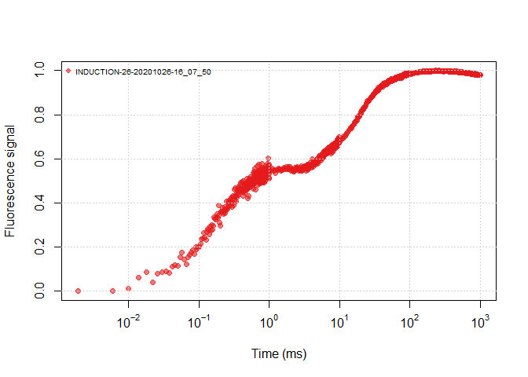
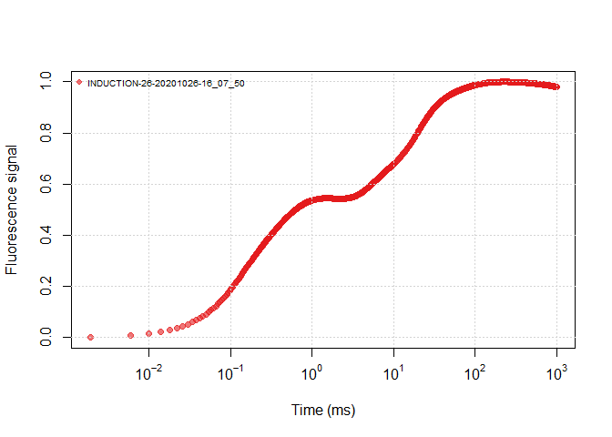

<!-- README.md is generated from README.Rmd. Please edit that file -->

# Jiptest for LI-6800 induction data

The purpose of the package are to help analysis the LI-6800 induction
data with JIP test,The method of calculation are from:

> Tsimilli-michael M. Revisiting JIP-test: Aneducative review on
> concepts, assumptions, approximations, definitions and
> terminology\[J\].Photosynthetica,2019,57 (SI): 90-107.

**As I am not a scientist, so please use with caution, and check the
`jip_comp.R` for the calculations. Any feedback will be appreciated.
What I am sure to help is the `plot` method to help view the data
quickly.**

## install and load

To install:

``` r
devtools::install_github("zhujiedong/jiptest")
```

To load:

``` r
library(jiptest)
```

## Read the induction files

There are 2 functions for this purpose, one is \`read_induction\`\`, to
read a single induction excel file:

``` r
# list all the induction excel files here
files <- list.files("inst/extdata/ojip", full.names = TRUE)
ojip_file1 <- read_induction(files[1])
```

    ## New names:
    ## • `` -> `...1`
    ## • `` -> `...2`
    ## • `` -> `...3`
    ## • `` -> `...4`
    ## • `` -> `...5`
    ## • `` -> `...6`
    ## • `` -> `...7`
    ## • `` -> `...8`
    ## • `` -> `...9`

``` r
knitr::kable(head(ojip_file1[,1:4]))
```

| EVENT_ID       | TRACE_NO |     SECS | FLUOR |
|:---------------|:---------|---------:|------:|
| MARGIN         | 5        | 1.90e-06 |   971 |
| DURATION       | 1000     | 6.00e-06 |   971 |
| Q_RED_SETPOINT | 15000    | 1.00e-05 |  1002 |
| D_RED_PERCENT  | 90       | 1.41e-05 |  1118 |
| FMAX           | 3390.12  | 1.81e-05 |  1185 |
| QMAX           | 15481.4  | 2.19e-05 |  1071 |

Another one is to read all the data files in batch, and in a tidy data
form:

``` r
all_files <- read_all_induction("inst/extdata/ojip")
```

    ## New names:
    ## New names:
    ## New names:
    ## New names:
    ## New names:
    ## New names:
    ## • `` -> `...1`
    ## • `` -> `...2`
    ## • `` -> `...3`
    ## • `` -> `...4`
    ## • `` -> `...5`
    ## • `` -> `...6`
    ## • `` -> `...7`
    ## • `` -> `...8`
    ## • `` -> `...9`

``` r
knitr::kable(rbind(head(all_files), tail(all_files)))
```

| EVENT_ID       | TRACE_NO |      SECS |   FLUOR |     DC |     PFD | REDMODAVG | CODE | SOURCE                          | NORM_FLUOR |   NORM_DC |   MILLI_SEC |
|:---------------|:---------|----------:|--------:|-------:|--------:|----------:|-----:|:--------------------------------|-----------:|----------:|------------:|
| MARGIN         | 5        | 0.0000019 |  971.00 | 163589 | 15474.2 |   24.9990 |    3 | INDUCTION-26-20201026-16_07_50  |  0.0000000 | 0.0000000 | 1.90740e-03 |
| DURATION       | 1000     | 0.0000060 |  971.00 | 166127 | 15468.7 |   24.9990 |    3 | INDUCTION-26-20201026-16_07_50  |  0.0000000 | 0.0071962 | 5.96060e-03 |
| Q_RED_SETPOINT | 15000    | 0.0000100 | 1002.00 | 168725 | 15468.3 |   24.9990 |    3 | INDUCTION-26-20201026-16_07_50  |  0.0128031 | 0.0145625 | 1.00137e-02 |
| D_RED_PERCENT  | 90       | 0.0000141 | 1118.00 | 171303 | 15467.2 |   24.9990 |    3 | INDUCTION-26-20201026-16_07_50  |  0.0607117 | 0.0218721 | 1.40668e-02 |
| FMAX           | 3390.12  | 0.0000181 | 1185.00 | 174013 | 15468.2 |   24.9990 |    3 | INDUCTION-26-20201026-16_07_50  |  0.0883830 | 0.0295560 | 1.81198e-02 |
| QMAX           | 15481.4  | 0.0000219 | 1071.00 | 176819 | 15468.6 |   24.9990 |    3 | INDUCTION-26-20201026-16_07_50  |  0.0413005 | 0.0375121 | 2.19346e-02 |
| NA             | NA       | 0.9800160 | 4129.87 | 635389 | 15117.4 |   24.9986 |    3 | INDUCTION-486-20171225-14_33_46 |  0.9706033 | 0.9751675 | 9.80016e+02 |
| NA             | NA       | 0.9840160 | 4132.01 | 635327 | 15117.3 |   24.9986 |    3 | INDUCTION-486-20171225-14_33_46 |  0.9712629 | 0.9750420 | 9.84016e+02 |
| NA             | NA       | 0.9880160 | 4127.78 | 635262 | 15117.1 |   24.9986 |    3 | INDUCTION-486-20171225-14_33_46 |  0.9699591 | 0.9749105 | 9.88016e+02 |
| NA             | NA       | 0.9920160 | 4126.07 | 635200 | 15117.0 |   24.9986 |    3 | INDUCTION-486-20171225-14_33_46 |  0.9694320 | 0.9747850 | 9.92016e+02 |
| NA             | NA       | 0.9960160 | 4127.87 | 635136 | 15116.9 |   24.9986 |    3 | INDUCTION-486-20171225-14_33_46 |  0.9699868 | 0.9746555 | 9.96016e+02 |
| NA             | NA       | 1.0000200 | 4125.81 | 635077 | 15108.1 |   24.9986 |    3 | INDUCTION-486-20171225-14_33_46 |  0.9693518 | 0.9745361 | 1.00002e+03 |

## Calculation

The calculation is done by `jip_test` function, it has a parameter
called `use_PAM`, the default value is FALSE, which means it use the
continuous fluorescence data by default, if TRUE, it will use the PAM
fluorescence.

``` r
ojip_data_pam <- jip_test(ojip_file1, use_PAM = TRUE) 
ojip_data<- jip_test(ojip_file1) 
knitr::kable(tail(ojip_data))
```

| OJIP_PARAMETERS |       VALUES | SOURCE                         |
|:----------------|-------------:|:-------------------------------|
| Sm              | 1.080540e+00 | INDUCTION-26-20201026-16_07_50 |
| N               | 1.411901e+06 | INDUCTION-26-20201026-16_07_50 |
| RC_ABS          | 5.000000e-07 | INDUCTION-26-20201026-16_07_50 |
| gamma_RC        | 5.000000e-07 | INDUCTION-26-20201026-16_07_50 |
| PI_ABS          | 9.000000e-07 | INDUCTION-26-20201026-16_07_50 |
| PI_total        | 3.000000e-07 | INDUCTION-26-20201026-16_07_50 |

You can also get all the data in a file, there is a column called
`SOURCE`, that use the file name which the data come from to distinguish
data from different excel files.

``` r
all_data_continuous<- jip_test(all_files)
all_data_pam <- jip_test(all_files, use_PAM = TRUE)
```

For most normalized calculated parameters, the differences between
use_PAM or not are almost zero:

``` r
paste('difference value of', ojip_data$OJIP_PARAMETERS, "=", ojip_data$VALUES - ojip_data_pam$VALUES)
```

    ##  [1] "difference value of F20us = 172828"                  
    ##  [2] "difference value of F50us = 194769"                  
    ##  [3] "difference value of F100us = 226884"                 
    ##  [4] "difference value of F300us = 300152"                 
    ##  [5] "difference value of FJ = 352927.2"                   
    ##  [6] "difference value of FI = 473990.17"                  
    ##  [7] "difference value of FP = 512882.72"                  
    ##  [8] "difference value of Area = 365800.722324911"         
    ##  [9] "difference value of FO = 172828"                     
    ## [10] "difference value of FM = 512882.72"                  
    ## [11] "difference value of FV = 340054.72"                  
    ## [12] "difference value of VJ = 0.00999990549752783"        
    ## [13] "difference value of VI = 0.0117033259273246"         
    ## [14] "difference value of MO = 687656.18631117"            
    ## [15] "difference value of Ss = -0.000120302009516987"      
    ## [16] "difference value of phi_Po = 0.0122677153328239"     
    ## [17] "difference value of phi_Eo = -0.000735407538679844"  
    ## [18] "difference value of phi_Ro = -0.00621108165913474"   
    ## [19] "difference value of Psi_Eo = -0.00999990549752783"   
    ## [20] "difference value of delta_Ro = -0.0192958193706238"  
    ## [21] "difference value of ABS_RC = 1958302.41027397"       
    ## [22] "difference value of TRo_RC = 1298402.78692407"       
    ## [23] "difference value of ETo_RC = 610746.600612896"       
    ## [24] "difference value of REo_RC = 148502.170298297"       
    ## [25] "difference value of ECo_RC = -0.743876067841061"     
    ## [26] "difference value of Sm = -0.743876067841061"         
    ## [27] "difference value of N = 1396831.59271134"            
    ## [28] "difference value of RC_ABS = -7.82684126465109e-05"  
    ## [29] "difference value of gamma_RC = -7.82622077707698e-05"
    ## [30] "difference value of PI_ABS = -0.00013480306468376"   
    ## [31] "difference value of PI_total = -4.80287024276036e-05"

## plot data

It is useful to view all the data through a plot, you can view an OJIP
plot by the following ways:

### To view one file

``` r
plot(ojip_file1, use_PAM = TRUE)
```

<!-- -->

``` r
plot(ojip_file1)
```

<!-- -->

### To view all files

``` r
plot(all_files, use_PAM = TRUE)
```

<!-- -->

``` r
plot(all_files)
```

<!-- -->

Similar to other functions with argument `use_PAM`, you can view the PAM
data or the continuous data. The fluorecence data are normalized by:


it will help the Y axis in a range of 0\~1.

## PCA analysis

To help us analyse the results with PCA, a function called `jip_pca` can
help us to have a quick view of all the data. There is only one
parameter for the function, that is the returned data frame from
`jiptest`, to get the data for PCA analysis use continuous light:

``` r
library("FactoMineR")
library("factoextra")
```

    ## Loading required package: ggplot2

    ## Welcome! Want to learn more? See two factoextra-related books at https://goo.gl/ve3WBa

``` r
pca_df <- jip_pca(all_data_continuous)
```

Assume that these excel file in the folder of ojip contains flies of
different treatments (actually they belong to different species that
test in different years), we assume data from the same year (indicated
by the file names) are the same treatment. we should change the column
of `SOURCE` in the data file to what treatment they belongs, not the
file names they are from:

First we should check the file names of `SOURCE`:

``` r
pca_df$SOURCE
```

    ## [1] "INDUCTION-26-20201026-16_07_50"   "INDUCTION-2896-20180802-09_27_02"
    ## [3] "INDUCTION-4188-20201116-10_53_39" "INDUCTION-484-20171225-13_15_58" 
    ## [5] "INDUCTION-485-20171225-14_12_14"  "INDUCTION-486-20171225-14_33_46"

Then we can use a function from `jiptest` to help change the `SOURCE`
column to different groups that indicate treatments/replications etc.

``` r
# use a short name that easy to distinguish
treatment <-
  c('2020_species',
    '2018_spices',
    '2020_species',
    rep('2017_spices', 3))

pca_df$SOURCE <- sub_name(pca_df, treatment)
pca_df$SOURCE
```

    ## [1] "2020_species" "2018_spices"  "2020_species" "2017_spices"  "2017_spices" 
    ## [6] "2017_spices"

``` r
df <- pca_df[,-1]
final_pca <- PCA(df, graph = FALSE)
fviz_eig(final_pca, addlabels = TRUE)
```

<!-- -->

``` r
fviz_pca_var(final_pca)
```

<!-- -->

``` r
fviz_pca_ind(final_pca, repel = TRUE, col.ind= pca_df$SOURCE)
```

<!-- -->

To use PAM:

``` r
pca_df <- jip_pca(all_data_pam)

df <- pca_df[,-1]
final_pca <- PCA(df, graph = FALSE)
fviz_eig(final_pca, addlabels = TRUE)
```

<!-- -->

``` r
fviz_pca_var(final_pca)
```

<!-- -->

``` r
fviz_pca_ind(final_pca, repel = TRUE, col.ind= pca_df$SOURCE)
```

<!-- -->
